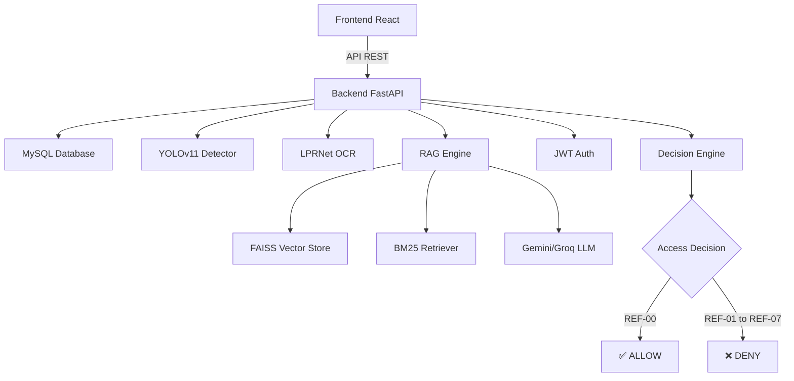

# 🅿️ FacPark — Système de Parking Universitaire Intelligent

<div align="center">


</div>

> **Gestion intelligente de parking universitaire avec reconnaissance de plaques par IA et assistant virtuel conversationnel.**

---

## 📑 Table des Matières
- [📋 À propos](#-à-propos)
- [🌟 Fonctionnalités](#-fonctionnalités)
- [🛠️ Stack Technique](#️-stack-technique)
- [🏗️ Architecture](#️-architecture)
- [📁 Structure du Projet](#-structure-du-projet)
- [🚀 Installation](#-installation)
- [💻 Utilisation](#-utilisation)
- [📊 Codes de Décision](#-codes-de-décision)
- [📸 Captures d'écran](#-captures-décran)
- [🗺️ Roadmap](#️-roadmap)
- [❓ FAQ](#-faq)
- [🤝 Contribution](#-contribution)
- [📄 Licence](#-licence)
- [📞 Contact](#-contact)

---

## 📋 À propos

**FacPark** est un système intelligent de gestion de parking universitaire développé dans le cadre d'un projet de fin d'études à l'IIT Sfax. Il combine Computer Vision (YOLOv11, OCR) et IA générative (RAG) pour automatiser le contrôle d'accès et fournir une assistance virtuelle 24/7.

### 🎯 Objectifs
- **Automatiser** la gestion des entrées/sorties
- **Réduire** le temps d'attente aux barrières
- **Moderniser** l'administration des parkings universitaires
- **Améliorer** l'expérience utilisateur étudiants/administrateurs

### 💡 Innovation
- ✅ Reconnaissance de plaques **tunisiennes** (arabe + chiffres latins)
- ✅ Assistant RAG contextuel pour le règlement
- ✅ Décisions en temps réel (<500ms)
- ✅ Système expert déterministe anti-fraude
- ✅ Architecture Clean avec séparation des préoccupations

---

## 🌟 Fonctionnalités

### 🧠 Intelligence Artificielle
- **Détection de plaques** — YOLOv11 (temps réel, >95% précision)
- **OCR (LPRNet)** — Lecture de plaques tunisiennes (arabe + chiffres)
- **Assistant RAG** — Chatbot hybride FAISS + BM25 pour le règlement
- **Moteur de décision** — Système expert déterministe (ALLOW/DENY)

### 💻 Interface Utilisateur
- **Dashboard Étudiant** — Véhicules, abonnements, chatbot
- **Dashboard Admin** — Statistiques, logs, supervision
- **Simulation Barrière** — Upload photo → détection → décision d'accès

### 🔒 Sécurité
- Détection d'injections de prompt (regex + score de risque)
- RBAC strict (rôles Admin/Étudiant)
- JWT avec rotation (access 60min + refresh 7j)
- Anti-hallucination RAG

---

## 🛠️ Stack Technique

| Couche | Technologies |
|--------|-------------|
| **Backend** | FastAPI, SQLAlchemy, PyTorch, LangChain |
| **Frontend** | React 18, Vite, TailwindCSS, Recharts |
| **Base de données** | MySQL (XAMPP) |
| **Modèles IA** | YOLOv11 (détection), LPRNet (OCR) |
| **LLM** | Gemini / Groq (fallback) |
| **RAG** | FAISS + BM25 + RRF (Reciprocal Rank Fusion) |

### Technologies détaillées

#### Backend


#### Frontend


#### AI & ML


---

## 🏗️ Architecture



### Flux de traitement

**1. Authentification**
```
User → JWT Token → Protected Routes → Dashboard
```

**2. Détection de plaque**
```
Image Upload → YOLOv11 Detection → LPRNet OCR → Plate Number
```

**3. Décision d'accès**
```
Plate → DB Lookup → Rules Check → Decision Code → Barrier Control
```

**4. Chatbot RAG**
```
Question → Embedding → Hybrid Search (FAISS+BM25) → LLM → Response
```

---

## 📁 Structure du Projet

```text
FacPark/
├── backend/                    # API FastAPI
│   ├── api/                    # Endpoints REST
│   │   ├── auth.py             #   Authentification (JWT)
│   │   ├── chat.py             #   Chatbot / Agent
│   │   ├── vision.py           #   Détection + OCR
│   │   └── admin.py            #   Administration
│   ├── core/                   # Logique métier
│   │   ├── agent.py            #   Agent LLM + Tools
│   │   ├── decision.py         #   Moteur de décision
│   │   ├── rag.py              #   Pipeline RAG
│   │   ├── tools.py            #   Outils étudiant
│   │   └── tools_admin.py      #   Outils admin
│   ├── db/                     # Base de données
│   │   ├── models.py           #   Modèles SQLAlchemy
│   │   └── session.py          #   Session DB
│   ├── vision/                 # Modèles de vision
│   │   ├── detector.py         #   YOLO detector
│   │   └── ocr.py              #   LPRNet OCR
│   ├── eval/                   # Évaluation RAG
│   ├── scripts/                # Scripts utilitaires
│   │   ├── init_db.py          #   Initialisation DB
│   │   ├── ingest_docs.py      #   Ingestion documents RAG
│   │   ├── populate_slots.py   #   Créer les places
│   │   └── activate_subscription.py
│   ├── config.py               # Configuration centralisée
│   ├── main.py                 # Point d'entrée FastAPI
│   └── requirements.txt        # Dépendances Python
├── frontend/                   # Application React
│   ├── src/
│   │   ├── components/         # Composants UI
│   │   ├── pages/              # Pages (Login, Dashboards)
│   │   ├── context/            # AuthContext
│   │   └── services/           # API client
│   ├── package.json
│   └── vite.config.js
├── data/
│   ├── docs/                   # Documents RAG (règlement)
│   └── sql/                    # Scripts SQL
│       ├── 01_schema.sql       #   Schéma de la BD
│       ├── 02_seed.sql         #   Données de test
│       └── 03_indexes.sql      #   Index de performance
├── models/                     # Modèles IA (non versionnés)
│   ├── *.pt                    #   YOLO weights
│   ├── *.pth                   #   LPRNet weights
│   └── vocabulary.json         #   Vocabulaire OCR
├── docs/                       # Documentation technique
├── .env.example                # Template des variables d'env
├── .gitignore                  # Fichiers exclus
├── start_project.bat           # Script de lancement Windows
└── README.md                   # Ce fichier
```

---

## 🚀 Installation

### Prérequis
- Python **3.9+**
- Node.js **18+**
- MySQL (via XAMPP)
- CUDA (recommandé pour la vision)
- Git

### 1. Cloner le dépôt
```bash
git clone https://github.com/Mokh-07/FacPark.git
cd FacPark
```

### 2. Backend
```bash
cd backend
python -m venv venv
venv\Scripts\activate          # Windows
# source venv/bin/activate     # Linux/Mac

pip install --upgrade pip
pip install -r requirements.txt
```

### 3. Variables d'environnement
```bash
copy .env.example .env
# Éditez .env et remplissez vos clés API (GEMINI_API_KEY et/ou GROQ_API_KEY)
```

**Exemple .env :**
```ini
# Database
DB_HOST=localhost
DB_PORT=3306
DB_USER=root
DB_PASSWORD=
DB_NAME=facpark

# AI APIs
GEMINI_API_KEY=your_gemini_key_here
GROQ_API_KEY=your_groq_key_here

# JWT
JWT_SECRET_KEY=your_secret_key_here
JWT_ALGORITHM=HS256
```

### 4. Base de données MySQL
1. Démarrez MySQL dans XAMPP
2. Créez la base :
   ```sql
   CREATE DATABASE facpark CHARACTER SET utf8mb4 COLLATE utf8mb4_unicode_ci;
   ```
3. Exécutez les scripts dans l'ordre :
   - `data/sql/01_schema.sql`
   - `data/sql/02_seed.sql`
   - `data/sql/03_indexes.sql`

### 5. Modèles IA
Téléchargez les modèles et placez-les dans `models/` :

- **smartalpr_hybrid_640_yolo11l_v2_best.pt** — YOLO detection
- **SmartALPR_LPRNet_v10_seed456_best.pth** — LPRNet OCR
- **vocabulary.json** — Vocabulaire de caractères

### 6. Ingestion RAG
```bash
# Depuis la racine du projet, avec le venv activé
python -m backend.scripts.ingest_docs
```

### 7. Frontend
```bash
cd frontend
npm install
```

### 8. Lancement

**Option A — Script automatique (Windows) :**
```bash
start_project.bat
```

**Option B — Manuel :**
```bash
# Terminal 1 (Backend)
cd backend
uvicorn main:app --reload --host 0.0.0.0 --port 8000

# Terminal 2 (Frontend)
cd frontend
npm run dev
```

### Accès aux services

| Service | URL |
|---------|-----|
| **Backend API** | http://localhost:8000 |
| **Frontend** | http://localhost:5173 |
| **API Docs** | http://localhost:8000/docs |

---

## 💻 Utilisation

### 🎓 Espace Étudiant

1. **Connexion**
   ```
   Email: ahmed.benali@etudiant.fac.tn
   Mot de passe: student123
   ```

2. **Enregistrer un véhicule**
   - Aller dans "Mes Véhicules"
   - Cliquer "Ajouter un véhicule"
   - Saisir la plaque (format tunisien : 123 تونس 4567)

3. **Gérer son abonnement**
   - Voir l'état de l'abonnement
   - Vérifier la place assignée
   - Consulter l'historique

4. **Utiliser le chatbot**
   - Poser des questions sur le règlement
   - Exemples de questions :
     - *"Quels sont les horaires d'ouverture ?"*
     - *"Comment prolonger mon abonnement ?"*
     - *"Que faire si je perds ma carte ?"*

### 👨💼 Espace Administrateur

1. **Connexion**
   ```
   Email: admin@fac.tn
   Mot de passe: admin123
   ```

2. **Dashboard de supervision**
   - Statistiques en temps réel
   - Taux d'occupation
   - Logs d'accès

3. **Gestion des utilisateurs**
   - Créer/modifier/suspendre des comptes
   - Assigner des places
   - Gérer les abonnements

4. **Simulation barrière**
   - Upload une photo de plaque
   - Voir la détection YOLO en temps réel
   - Décision d'accès automatique avec code

---

## 📊 Codes de Décision

| Code | Signification | Action |
|------|--------------|--------|
| **REF-00** | ✅ Accès autorisé | Ouvrir la barrière |
| **REF-01** | ❌ Plaque non détectée | Vérifier la qualité de l'image |
| **REF-02** | ❌ Plaque non enregistrée | Véhicule inconnu dans la BD |
| **REF-03** | ❌ Pas d'abonnement actif | Compte sans abonnement valide |
| **REF-04** | ❌ Compte suspendu | Utilisateur banni |
| **REF-05** | ❌ Abonnement expiré | Renouveler l'abonnement |
| **REF-06** | ❌ Pas de place assignée | Attribuer une place |
| **REF-07** | ❌ Hors horaires d'ouverture | Parking fermé |

---

## 🗺️ Roadmap

### ✅ Version 1.0 (Actuelle - Février 2026)
- [x] Détection YOLOv11 temps réel
- [x] OCR LPRNet pour plaques tunisiennes
- [x] RAG chatbot avec FAISS+BM25
- [x] Dashboards étudiant/admin
- [x] Système de décision expert
- [x] JWT authentication avec rotation

### 🚧 Version 1.1 (Q2 2026)
- [ ] Application mobile (React Native)
- [ ] Notifications push (entrée/sortie, expiration)
- [ ] Export Excel/PDF des rapports
- [ ] Mode multi-campus
- [ ] Statistiques avancées (graphiques prédictifs)

### 🔮 Version 2.0 (Q3 2026)
- [ ] Prédiction d'affluence par Machine Learning
- [ ] Paiement en ligne des abonnements
- [ ] Intégration caméras réseau (RTSP)
- [ ] Mode hors ligne avec synchronisation
- [ ] API publique pour intégrations tierces

### 💡 Idées futures
- [ ] Reconnaissance faciale (backup OCR)
- [ ] Détection d'anomalies (vol, stationnement interdit)
- [ ] Assistant vocal pour le chatbot
- [ ] Dashboard mobile responsive
- [ ] Intégration avec systèmes universitaires (Moodle, etc.)

---

## ❓ FAQ

### **Q : Quels formats de plaques sont supportés ?**
**R :** Plaques tunisiennes uniquement (arabe + chiffres latins). Formats acceptés :
- `123 تونس 4567`
- `TUN 1234`
- `تونس 5678`

Le système peut être adapté pour d'autres pays en entraînant l'OCR sur de nouvelles données.

---

### **Q : Quelle est la précision de détection ?**
**R :** 
- **YOLOv11** : >95% de précision sur la détection de plaques
- **LPRNet OCR** : >90% de précision sur la lecture (conditions normales : lumière, angle, propreté)

Les performances peuvent diminuer avec :
- Faible luminosité
- Plaques sales ou endommagées
- Angles extrêmes (>45°)

---

### **Q : Peut-on utiliser d'autres LLMs que Gemini/Groq ?**
**R :** Oui ! Le client LLM est modulaire. Pour intégrer OpenAI, Anthropic, ou un modèle local :

1. Modifiez `backend/core/agent.py`
2. Ajoutez votre provider dans la configuration
3. Mettez à jour les variables d'environnement

Exemple pour OpenAI :
```python
from openai import OpenAI

llm = OpenAI(api_key=os.getenv("OPENAI_API_KEY"))
```

---

### **Q : Comment déployer en production ?**
**R :** Plusieurs options :

**1. Docker (Recommandé)**
```bash
docker-compose up -d
```

**2. VPS Linux**
```bash
# Backend avec Gunicorn
gunicorn -w 4 -k uvicorn.workers.UvicornWorker backend.main:app

# Frontend avec Nginx
npm run build
# Servir le dossier dist/ avec Nginx
```

**3. Cloud platforms**
- Backend → Railway, Render, DigitalOcean
- Frontend → Vercel, Netlify
- DB → PlanetScale, AWS RDS

---

### **Q : Le système fonctionne-t-il de nuit ?**
**R :** Oui, avec :
- Caméras infrarouge
- Éclairage LED adapté
- Augmentation de contraste en post-traitement

YOLOv11 est robuste aux conditions de faible luminosité.

---

### **Q : Les données sont-elles sécurisées ?**
**R :** Oui :
- ✅ JWT avec rotation des tokens
- ✅ Mots de passe hashés (bcrypt)
- ✅ RBAC (Role-Based Access Control)
- ✅ Validation des entrées (Pydantic)
- ✅ Protection contre injection SQL (SQLAlchemy ORM)
- ✅ HTTPS en production (recommandé)

---

### **Q : Puis-je contribuer au projet ?**
**R :** Absolument ! Voir la section [Contribution](#-contribution) ci-dessous.

---

## 🧪 Comptes de Test

| Rôle | Email | Mot de passe | Description |
|------|-------|-------------|-------------|
| **Admin** | admin@fac.tn | admin123 | Accès complet, supervision |
| **Étudiant** | ahmed.benali@etudiant.fac.tn | student123 | Compte actif avec abonnement |
| **Étudiant (suspendu)** | leila.bouazizi@etudiant.fac.tn | student123 | Compte banni (test REF-04) |

---

## 🤝 Contribution

Les contributions sont les bienvenues ! Voici comment participer :

### Comment contribuer

1. **Forkez** le projet
2. Créez une **branche** pour votre fonctionnalité
   ```bash
   git checkout -b feature/AmazingFeature
   ```
3. **Committez** vos changements en suivant les [Conventional Commits](https://www.conventionalcommits.org/)
   ```bash
   git commit -m 'feat: Add some AmazingFeature'
   ```
4. **Pushez** vers la branche
   ```bash
   git push origin feature/AmazingFeature
   ```
5. Ouvrez une **Pull Request**

### Lignes directrices

- Suivez le style de code existant (PEP 8 pour Python, ESLint pour React)
- Ajoutez des tests pour les nouvelles fonctionnalités
- Documentez les fonctions complexes (docstrings Google style)
- Mettez à jour le README si nécessaire
- Testez localement avant de soumettre

### Signaler un bug

Ouvrez une [issue](https://github.com/Mokh-07/FacPark/issues) en incluant :
- Description claire du problème
- Étapes pour reproduire
- Comportement attendu vs observé
- Logs d'erreur (si applicable)
- Environnement (OS, Python version, navigateur)

---

## 📄 Licence

Ce projet est développé dans un cadre **académique** pour l'IIT Sfax.

```
Projet Académique — Université de Tunis 2025/2026
Institut International de Technologie (IIT), Sfax

Développé par : Mokhtar Bouchekoua
Encadré par : [Nom de l'encadrant]

Ce projet est fourni "tel quel" à des fins éducatives.
L'utilisation commerciale nécessite une autorisation explicite.
```

---

## 📞 Contact

### 👨💻 Auteur

**Mokhtar Bouchekoua**
- 💼 [LinkedIn](https://linkedin.com/in/mokhtar-bouchekoua-084267248)
- 📧 Email : mokhtarbouchekoua@gmail.com
- 🐙 GitHub : [@Mokh-07](https://github.com/Mokh-07)

### 🏫 Institution

**Institut International de Technologie (IIT), Sfax**
- 🌐 Site web : [www.iit.tn](http://www.iit.tn)
- 📍 Localisation : Sfax, Tunisie

---

<div align="center">

**Développé avec ❤️ pour l'IIT Sfax**

* Année Académique 2025/2026*

[](https://fastapi.tiangolo.com)
[](https://react.dev)
[](https://python.org)

[⭐ Star ce projet](https://github.com/Mokh-07/FacPark) • [🐛 Signaler un bug](https://github.com/Mokh-07/FacPark/issues) • [💡 Proposer une fonctionnalité](https://github.com/Mokh-07/FacPark/discussions)

</div>
